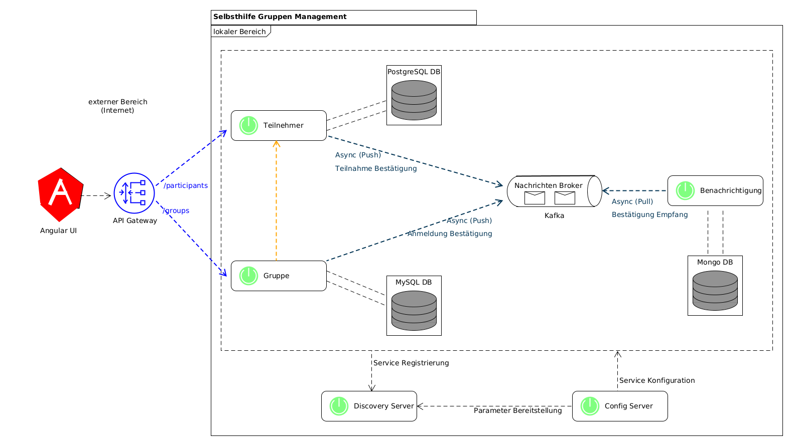

# Selbsthilfegruppen organisieren
Als kleines Zeitvertreib möchte ich ab heute eine weitere Open Source Applikation realisieren. 
Dabei soll es sich erneut alles um das Thema Selbsthilfe drehen. 

Hier stelle ich mir nun folgende Szenarien vor:

- Die Applikation soll vom Backend und Frontend Bereich getrennt werden. Die Verbindung erfolgt durch eine <b>REST-API</b>. Das Backend wird mit <b>Spring Boot</b> und Frontend mit <b>Angular</b> umgesetzt.
- Das System soll hochskalierbar sein. Die Anwendung wird dazu in mehere <b>Microservises</b> aufgeteilt. Es soll nach dem so genannten <b>Domain-driven Design (DDD)</b> Prinzip gearbeitet werden. Die dazu verwendeten Komponenten sind <b>Docker</b> und <b>Spring Cloud</b>.
- Die Speicherung der Daten soll unter mehreren Datenbanken erfolgen. Dazu werden die Datenbanken <b>MySQL</b>, <b>PostgreSQL</b> und <b>MongoDB</b> eingesetzt.
- Teilnehmer, die registriert oder in Gruppen zugewiesen werden, sollen per E-Mail benachricht werden. Dazu soll u. a. der Message Broker <b>Kafka</b> verwendet werden.
- Es soll ebenso eine gesicherte Kommunikation realisiert werden. Dazu soll ein passendes Verfahren später gefunden werden.
- Es soll gezeigt werden, dass auch Erweiterung mit anderen Frameworks wie <b>Quarkus</b> problemlos an die Gesamtumgebung angebunden werden kann.

## Darstellung Gesamtkonzept
Die gewählte Architektur baut sich wie folgt zusammen:

### Erläuterung des Konzepts
Insgesamt sollen als erstes 3 Microservises (Teilnehmer, Gruppe und Benachrichtigung) aufgebaut werden, die unabhängig voneinander laufen und dadurch je nach Auslastung sich hoch- oder runterskalieren lassen.
Sowohl die Microservises, als auch die darin verwendeten Komponenten wie Datenbanken werden in Kontainern durch Docker ausgeführt. Die globale Konfiguration steuert der s.g. <b>Config Server</b>, der alle nötigen Parameter sowohl  
dem <b>Discovery Server</b>, als auch den einzelnen Microservises bereitstellt. Der Discovery Server registriert die einzelnen Microservises, was durch die Komponente <b>Eureka</b> erfolgt.

Sobald alle Microservises miteinander kommunizieren und auch mit der REST-Api von Außen erreichbar sind, wird das API Gateway mithilfe von <b>Swagger UI</b> durch die s.g. <b>OpenAPI</b> in die GUI transformiert.
Diese GUI wird mithilfe von Angular realisiert. 

## weitere Infos
Eine erweiterte Beschreibung, sowie Tipps finden Sie unter dem Verzeichnis [Zusätzliche Informationen](/additional_infos) bzw. 'additional_infos/'

## Änderungsverlauf
Sofern aktuell, befinden sich historische Änderungen unter [Änderungsübersicht](additional_infos/history.md)
